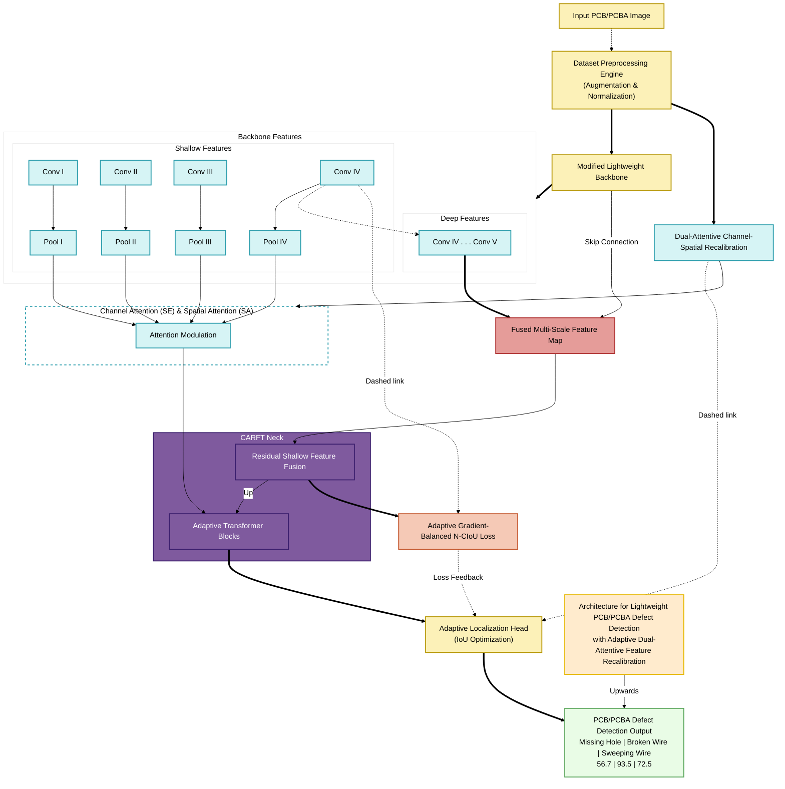

# PCB/PCBA Defect Detection Architecture

This document contains the architecture diagram for the Lightweight PCB/PCBA Defect Detection model, utilizing Adaptive Dual-Attentive Feature Recalibration.

The diagram is written in [Mermaid](https://mermaid.js.org/) and can be previewed in any Markdown viewer that supports Mermaid rendering (such as GitHub, VS Code, or Typora).

## Architecture Flow

